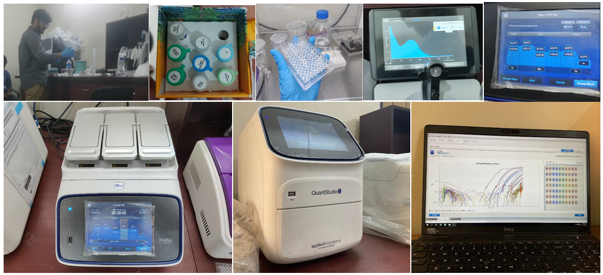

# BioSalT: a multigene machine learning model for early salinity stress detection in Solanum lycopersicum.



Authors
-------

Hossen, K.†, Debnath, J. P.†, Datta, U., and Ghosh, A.*

Supervisor
----------

Ajit Ghosh, PhD
Associate Professor of Biochemistry & Molecular Biology
Shahjalal University of Science and Technology
[Google Scholar profile](https://scholar.google.com/citations?hl=en&user=VESJwAMAAAAJ&view_op=list_works&sortby=pubdate)

Short summary
-------------

BioSalT compares feature importance from Random Forest (Gini) and XGBoost (Gain) to identify key dysregulated transcripts that mark early salinity stress across tomato (Solanum lycopersicum) variants. The pipeline integrates wet‑lab validation (PCR and qRT‑PCR) with machine learning to prioritize biomarkers for downstream functional studies.

Wet‑lab methods (summary)
-------------------------

- Plant sample RNA was extracted and quantified with a NanoDrop spectrophotometer.
- cDNA synthesis was confirmed by PCR using EF1ɑ (housekeeping) and target‑gene primers; products were visualized on agarose gels to confirm primer specificity and amplification.
- Candidate biomarkers were validated by qRT‑PCR. Relative log2 fold change was calculated from Ct values using the ∆∆Ct method.

Computational methods (summary)
-------------------------------

- Expression/count data were preprocessed (normalization and filtering of low‑expression transcripts).
- Machine learning models used:
  - Random Forest (feature importance via Gini impurity)
  - XGBoost (feature importance via Gain)
- Feature importance rankings from both models were compared to identify robust candidate biomarkers.
- Downstream steps include visualization (importance plots, clustering) and shortlisting top transcripts for wet‑lab validation.

Key results (high level)
------------------------

- The combined approach (RF + XGBoost) yields a set of top-ranked transcripts that correlate with early salinity stress response across variants. These candidates were taken forward for qRT‑PCR validation and showed consistent dysregulation in stressed plants (see notebooks and result plots in the repo).

Data and code
-------------

- Primary processed count data used in model training can be found in the repository (for example, see `XGboost/Count_Data_final.csv`).
- Analysis notebooks and scripts are stored under `analysis/` and related subfolders. Check the `XGboost/` folder for model-related artifacts.

How to reproduce (recommended minimal steps)
-------------------------------------------

1. Create a Python environment (suggested):

```powershell
python -m venv .venv; .\.venv\Scripts\Activate.ps1
pip install -r requirements.txt
```

2. Open the relevant notebook (e.g., an analysis notebook under `analysis/` or `XGboost/`) and follow the notebooks' cells to preprocess data, train Random Forest and XGBoost models, and generate importance plots.

3. For wet‑lab validation, follow the experimental notes in `wetlab/` and the protocol files included in the repository.

Dependencies (suggested)
------------------------

- Python 3.8+ with: pandas, numpy, scikit-learn, xgboost, matplotlib, seaborn, jupyterlab/notebook
- R (optional) for additional plotting or differential expression tools

Notes and caveats
-----------------

- Feature importance methods measure association, not causation. Shortlisted transcripts should be validated experimentally (as done here via qRT‑PCR).
- Model stability depends on preprocessing (normalization, batch correction) and sample size; examine cross‑validation and repeat importance analyses where possible.

Contact and citation
--------------------

If you use BioSalT or code from this repository, please cite:

Hossen, K.†, Debnath, J. P.†, Datta, U., and Ghosh, A.* BioSalT: a multigene machine learning model for early salinity stress detection in Solanum lycopersicum.

For supervision and correspondence:

Ajit Ghosh, PhD — Associate Professor of Biochemistry & Molecular Biology, Shahjalal University of Science and Technology
Verified email at sust.edu — [Homepage / Google Scholar above]

License
-------

Shared under the terms specified in the repository (please add a LICENSE file if needed).
